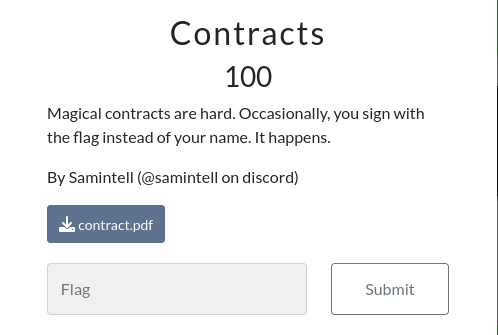
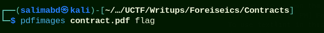
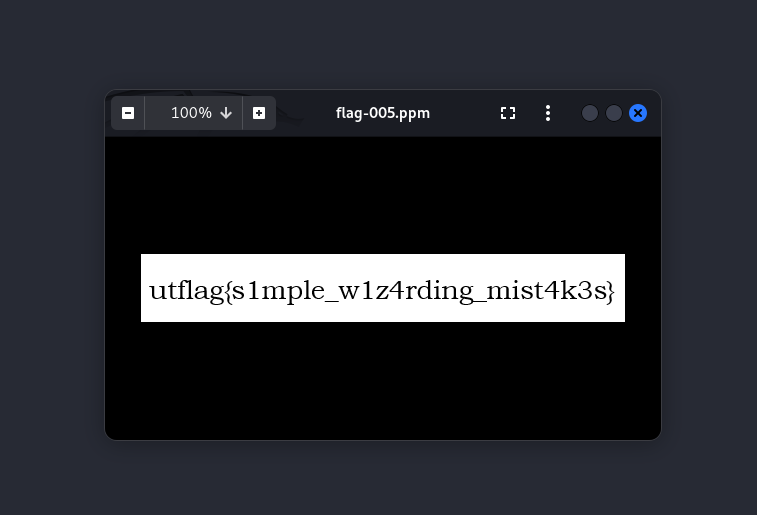

<!-- 
<h3 align="center">CS student and a passionate web developer</h3> -->

<!--   my-ticker -->    
<!-- &emsp;&emsp;&emsp;&emsp;&emsp;&emsp;&emsp;&emsp;&emsp; -->

  

## Contracts 	

### Infos About challenge : 

You can solve it Locally

## Solution:

### step 1 : Open The Contacts.pdf

##### You notice that the PDF Hasn't any information about the flag so the solution is not there 

### Step 2 : Search about tool that extract from a pdf differente componants (Text , images .....)

##### After Searching  : You LINUX tools such as pdftotext or pdfimages : 

###### When you try pdfimages 

### You will notice that new pictures are created in your folder 

#### When you pass from all pictures you will find the flag 

### flag:

#### utflag{s1mple_w1z4rding_mist4k3s}
