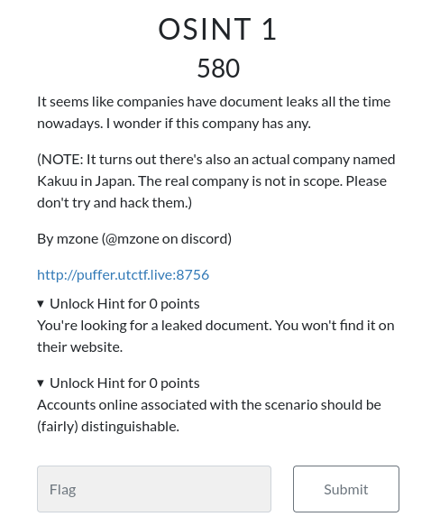
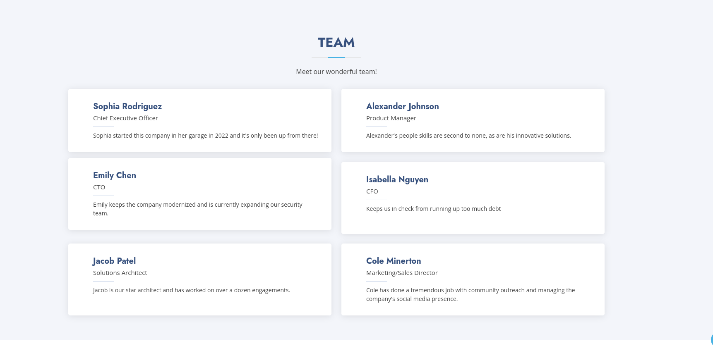
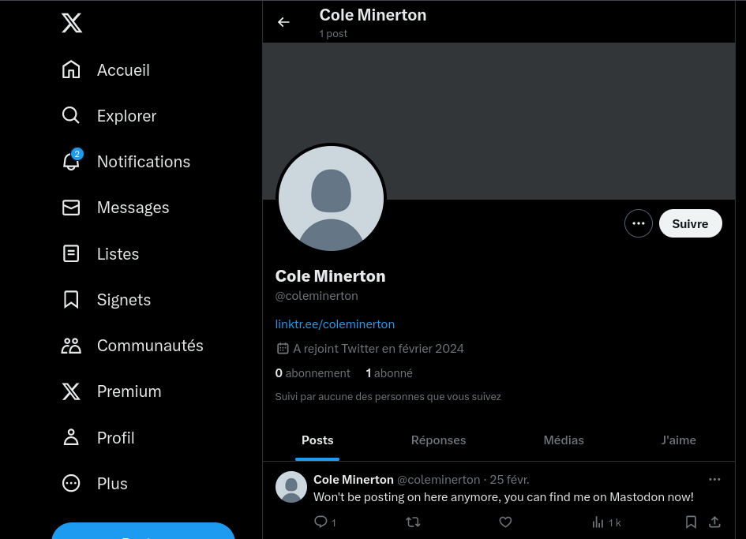
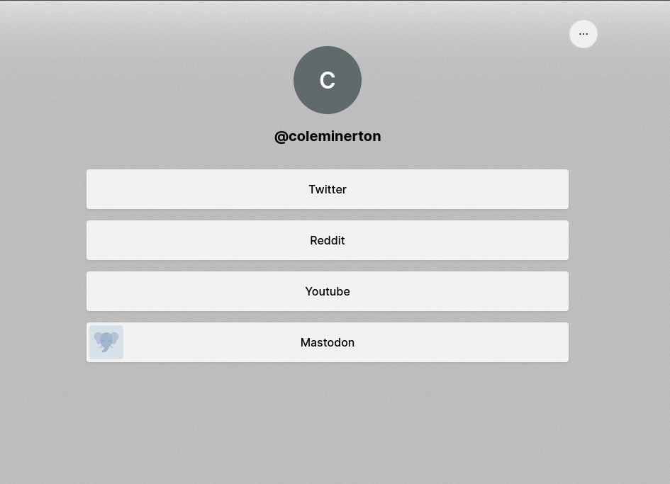
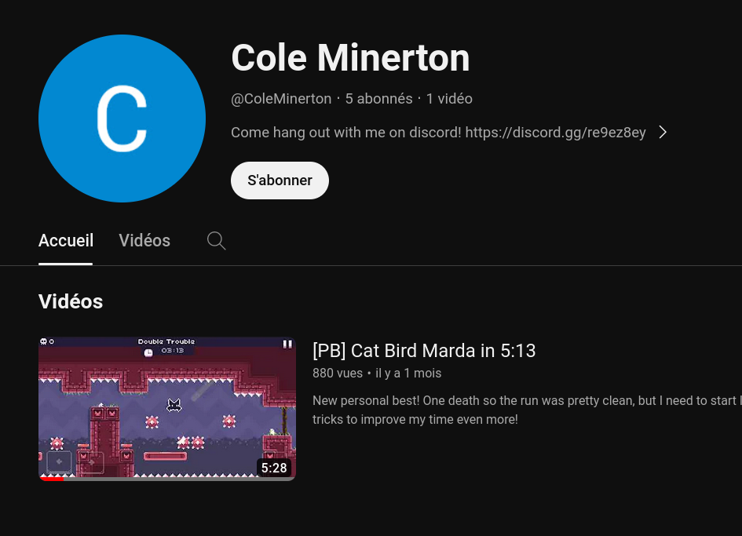
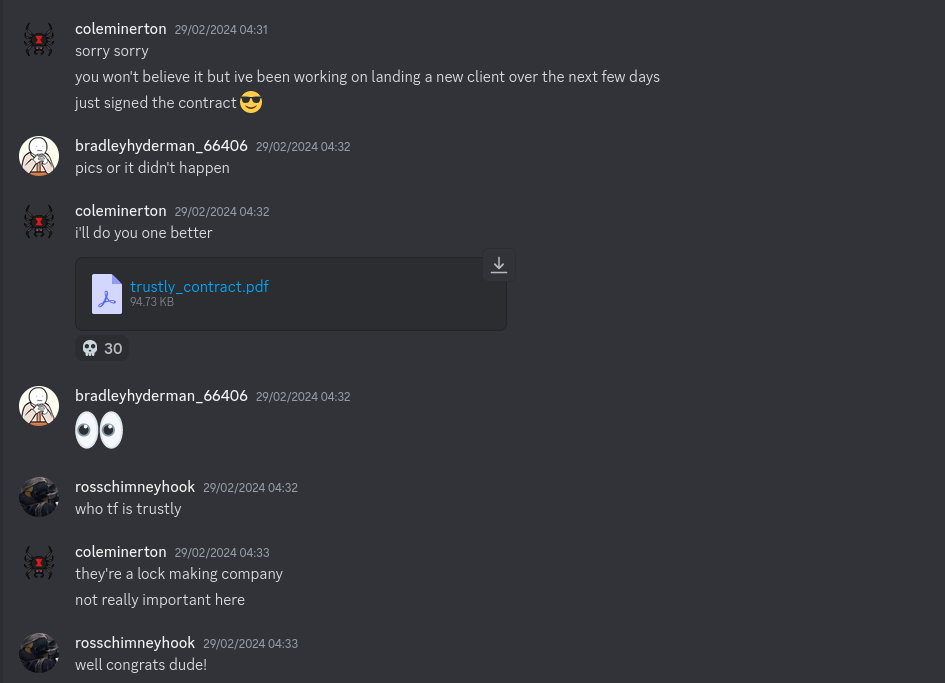
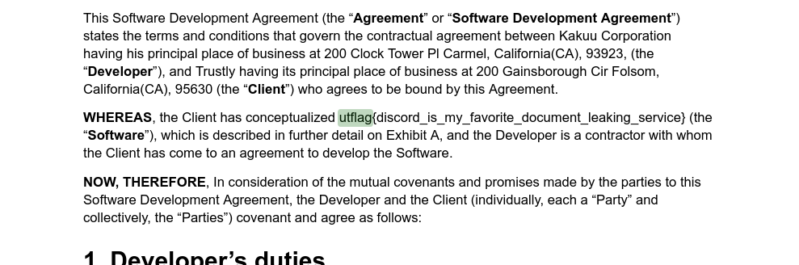

<!-- 
<h3 align="center">CS student and a passionate web developer</h3> -->

<!--   my-ticker -->    
<!-- &emsp;&emsp;&emsp;&emsp;&emsp;&emsp;&emsp;&emsp;&emsp; -->

  

## OSINT1

### Infos About challenge : 

You can solve it Locally

## Solution:

### step 1 : Visit the Website mentioned in the challenge 

##### http://puffer.utctf.live:8756/

#### When you Scoll down in the website you Notice that it exist Board Member Section 

### Step 2 : Search about Informations about board members

##### After Thinking You can Guess that the Person who did the Action is : Cole Minerton  ---> Because He has a direct contact with the community 

#### When you Do some reseach You found His  X (Twitter) Account :

#### Then you will found The linktree in the bio of Twitter 

###### https://linktr.ee/coleminerton

### Step 3 : Search in The social media account about any another Info

###### After doing some research you can found The community discord server of COLE in Youtube Channel of COLE  

### Step 4 : Invastigate in the discord server Until you found the leaked Document 

###### After doing some research : 

#### Now Just open the PDF and search for utflag and You find the flag

## FLAG : 

###### utflag{discord_is_my_favorite_document_leaking_service}
