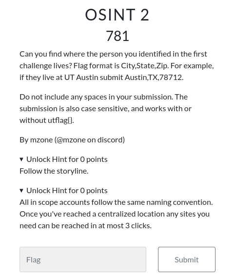
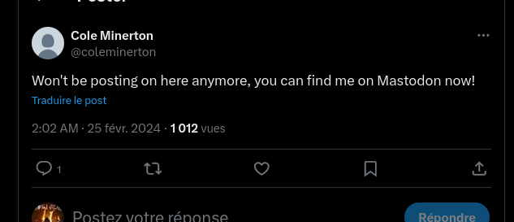
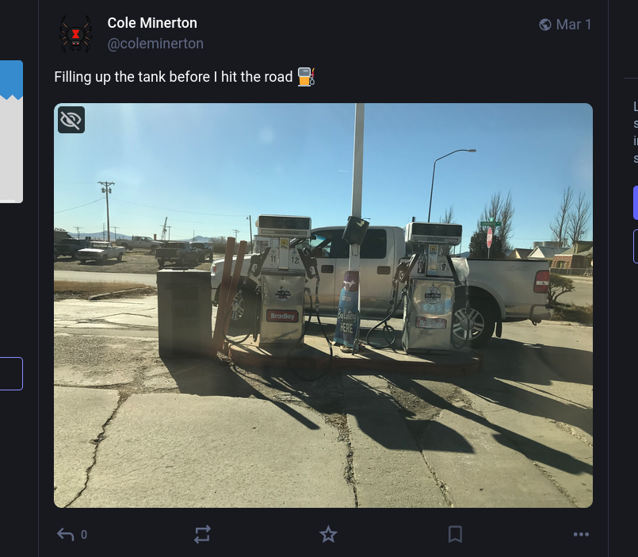
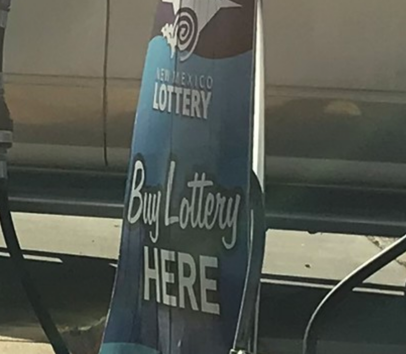
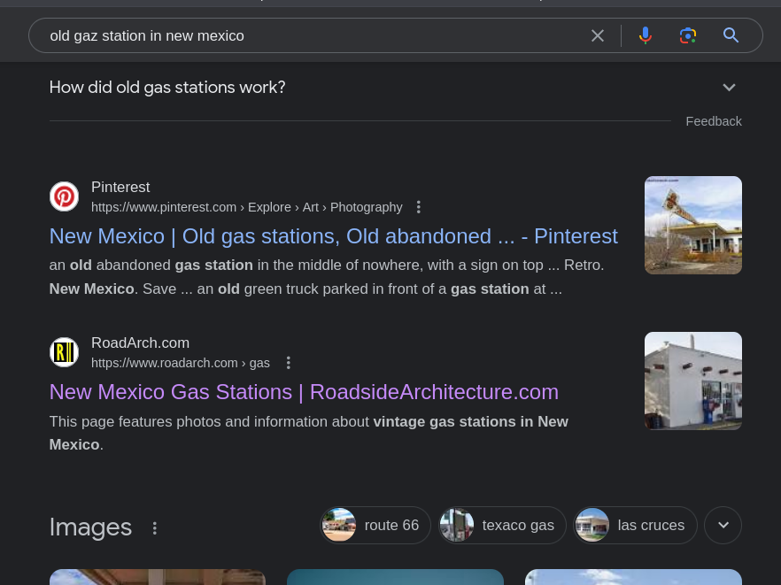
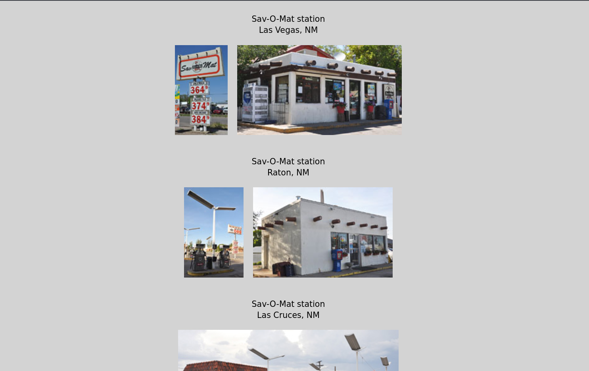
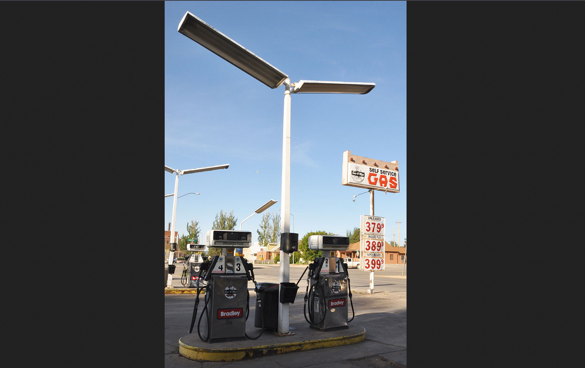
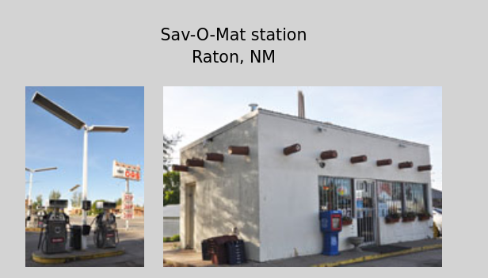

<!-- 
<h3 align="center">CS student and a passionate web developer</h3> -->

<!--   my-ticker -->    
<!-- &emsp;&emsp;&emsp;&emsp;&emsp;&emsp;&emsp;&emsp;&emsp; -->

  

## OSINT2

### Infos About challenge : 

You can solve it Locally

## Solution:

### They are two methods of solving : first following the story in discord 

### Or follow My solution XXXD

### step 1 : Read the Decription and the Hints !

#### You can remember the Twitter account and notice that has only one twitte 

###### and Said in it ""Won't be posting on here anymore, you can find me on Mastodon now!""

### Step 2 : Visit Mastodon ACCOUNT of COLE By Linktree 

###### https://mastodon.social/@coleminerton

##### You Should go to the last Post 

#### The post said : "Filling up the tank before I hit the road"

#### So the Picture it's In His CITY 

### Step 3 : Analyse The Post Picture 

#### First thing :   

#### So the State is New Mexico and exaclty Near to New mexico Lottery

###### So it,s near to  Albuquerque, New Mexico, United States

###### You can notice that the Gas Station is OLD 

### The LAST STEP it's searching For  Old gas station in New Mexico Near To Albuquerque

###### After doing some research in google : \

#### Now Just Visit some website and you found these super website : https://www.roadarch.com/gas/nm.html

 

### It's seems Like it our Gas Station 

 

#### Yes Same Pompes same stickers Bradley 

### So Congratulation This is the City 
 

## FLAG Format is  :  City,State,Zip. 

#### utflag{Raton,NM,87740}
